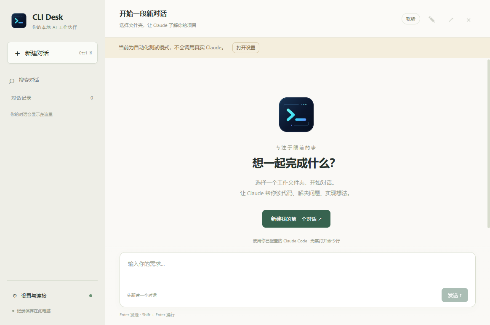

# CLI Desk

面向 AI 编程 CLI 的本地图形界面，提供 Windows x64 和 macOS Apple Silicon 构建。左侧管理对话，右侧显示消息和输入需求。使用 Tauri 2、应用私有 Node.js 和系统 WebView，无需自行安装 Node、启动 Web 服务或浏览器，安装包不携带 Chromium。

当前版本支持 **Claude Code**；后续计划支持 **Codex 等其他 CLI**，目前尚未实现后端切换。



[架构说明](docs/ARCHITECTURE.md) · [开发指南](docs/DEVELOPMENT.md) · [项目状态](docs/PROJECT_STATUS.md) · [变更记录](CHANGELOG.md) · [参与贡献](CONTRIBUTING.md)

这是独立开发的软件，不是 Anthropic 或 OpenAI 官方产品。应用自己的代码采用 MIT 许可证；第三方组件遵循各自许可证，官方 Claude Agent SDK 不因本项目的 MIT 许可证而改变许可条件。

## 使用

1. 在目标电脑确认 `claude --version` 和 `claude` 可以正常使用并已完成登录；Node.js 已随应用提供，无需单独安装。
2. Windows 运行对应版本的 `CLI-Desk-<版本>-Windows-x64-Setup.exe`；Mac M 系列使用 `CLI-Desk-<版本>-macOS-arm64.dmg`，将应用拖到 Applications。
3. 应用使用内置且经过校验的 Node.js 24 运行环境。Windows 复用系统 WebView2，缺失时安装器会联网补装。打开软件 →「设置与连接」→「检测连接」。检测只运行 `--version`，不验证模型服务和账号余额。
4. 如找不到 CLI，在能运行 Claude 的窗口中执行 `where.exe claude`，将结果路径填入设置。此命令同时适用于 CMD 和 PowerShell；PowerShell 中单独的 `where` 通常是筛选命令别名。支持原生 `claude.exe`，也支持标准 npm 安装生成的 `claude.cmd`（新版 `bin/claude.exe` 和旧版 `cli.js` 均支持），也可填写 `claude` 或留空自动查找。
5. 工作文件夹表示 Claude 实际读取和修改的已有项目目录，多个对话可以共享同一个目录。Claude 以相对路径生成的文件会写入该项目目录，文件属于项目而不是某个对话；互不相关的交付物应选择不同目录或明确使用不同子目录。输入框可选择或拖入文件和图片：目录内文件直接引用，目录外文件会复制到 `.cli-desk/attachments/<对话 ID>/`，后续修改作用于工作目录中的文件，外部原件不变。设置默认工作文件夹后，新建对话直接使用该目录。回答结束前发送按钮显示“运行中”并禁止重复发送。Ctrl+N 新建。
6. 可在「设置与连接」中配置新对话的默认模型 ID；创建对话时仍可修改或清空。已创建对话保存自己的模型选择，也可在左侧对话的右键菜单中修改，下一次发送时生效。
7. 左侧记录显示精确到秒的更新时间。右键对话可重命名、修改模型、打开当前目录、导出 Markdown 或选择「归档到本地」。归档会从列表隐藏应用内聊天记录、草稿和续聊入口，但不会删除项目文件、Claude 原始会话、账号或设置。可在「设置与连接 → 管理本地归档」中恢复或永久删除；运行中的对话需先停止。

macOS 可用 `which claude` 查看路径，自动发现也会检查用户安装目录、Homebrew 和 nvm 目录。macOS 构建由 Apple Silicon CI 运行器负责，Windows 本地验证不能替代 Mac 安装验收。Mac 构建目前为 ad-hoc 签名，尚未进行 Apple Developer ID 签名和公证，首次打开可能需要在系统隐私与安全性中确认。Windows ARM64、Intel Mac、WSL 内的 CLI 和自定义 bat 包装器尚未适配。目标电脑原有 Claude 依赖（例如 Git Bash、代理、MCP）需要保持可用。

## 窗口、托盘与安装目录

点击窗口关闭按钮会隐藏到右下角托盘，最小化则保留任务栏应用图标；正在运行的任务都会继续执行。点击托盘图标或右键选择「打开窗口」恢复；右键选择「退出」才会结束程序，有任务时会先确认并停止任务。Windows 可能将托盘图标收在右下角的上箭头菜单中。

全新安装统一使用 `CLI Desk` 名称和独立应用标识，不再读取或迁移旧名称目录。Windows 安装页面可以选择目录；再次运行同版本安装包或安装更高版本时，会直接覆盖同一用户下的现有版本，结束页默认不勾选创建桌面快捷方式。macOS 安装到 Applications。

## 已实现

- 新建、重命名、搜索、切换和归档对话；可从设置恢复归档或永久删除，每个对话独立绑定工作文件夹和 Claude 会话。
- 实时流式回复、Markdown、代码块复制和 Markdown 导出。
- 从输入框选择或拖入文件和图片；文件实体始终位于工作目录，Session 只保存附件元数据与相对路径。
- 工具调用详情；需要权限时显示「仅允许此次 / 拒绝」，支持 AskUserQuestion 的选择题、多选及自由回答。
- 停止生成、最多 3 个对话并行、退出时停止任务及子进程清理。
- 自动保存记录和草稿；JSON 原子写入和上一次写入的备份；意外退出标记和损坏文件恢复。
- 继承本机用户、项目和 local 的 Claude 设置；可指定 CLI 路径、模型及默认工作文件夹。
- 独立的桌面窗口和系统安装程序；界面不开放 HTTP 监听端口。

## 配置与数据

Claude 的登录和密钥继续由现有 Claude 配置管理。本应用不提供密钥输入框，不复制账号凭据。SDK 按 `user / project / local` 加载原有设置，同时使用 `default` 权限模式；已有的 allow/deny 规则仍然有效。本应用不会替你启用 bypassPermissions。

注意：在某个 CMD 窗口用 `set` 设置的环境变量只属于该窗口及其子进程，桌面快捷方式无法自动获得。若你依赖这样的配置，请从相同 CMD 启动安装后的 `cli-desk.exe`，或者将配置放在 Claude 支持的持久设置中。自定义启动脚本应先提供真实 Claude 程序路径。

数据目录为 Windows 的 `%APPDATA%/CLI Desk` 或 macOS 的 `~/Library/Application Support/CLI Desk`。准确路径可以在设置中通过「打开数据文件夹」查看：

- `runtime.json`：早期轻量版遗留配置；标准版不再读取，可安全删除。
- `settings.json`：程序路径、默认文件夹、模型偏好和发送按键，不包含本应用单独录入的密钥。
- `sessions/*.json`：聊天记录、草稿和 Claude 会话 ID。
- `*.bak`：上一版文件备份。
- `archive/`：由应用管理的本地归档，可在设置中恢复或永久删除。
- `trash/`：旧版本留下的归档记录；新版本会在同一个归档管理界面中显示并允许恢复或永久删除。

聊天与工具详情是本机明文文件，可能包含项目内容，备份时请按项目数据管理。应用不自动上传这些历史文件；实际发给 Claude 的请求仍由你已有的模型服务配置处理。卸载默认保留历史记录。

附件文件不存入上述应用数据目录。工作目录外的文件会先复制到项目的 `.cli-desk/attachments/<对话 ID>/`；移除或归档对话不会自动删除这些项目文件，避免误删模型已经修改的成果。

停止任务不会回滚已经执行的文件修改。若 CLI 自己的历史文件被清理，界面记录虽然还在，但对应原生会话可能无法续接；这种情况请新建对话并提供必要背景。

## 使用边界

本应用通过官方 Agent SDK 调用本机 CLI，并不是完整终端仿真。终端交互命令如 `/login`、`/doctor`、某些插件的专用交互应继续在原 CMD 中运行；完成后回到本应用继续。不会自动导入所有原 CMD 的历史会话。

模型服务费用和订阅额度遵循提供方对程序化 CLI / SDK 调用的规则，本应用不会改变计费方式。

自动化测试覆盖软件行为及 CLI 协议，不代表真实模型服务验收完成。首次安装后仍需在目标电脑做真实服务验收：普通问答、读取测试文件、确认后修改文件、重启续聊、停止任务。不能将测试替身的成功等同于真实模型联调完成。

## 开发

需要 Node.js 22.12+、npm、Rust stable 和系统编译工具（Windows C++ Build Tools / macOS Xcode command-line tools）。锁定依赖见 package-lock.json 与 src-tauri/Cargo.lock。

```powershell
npm ci --omit=optional
npm run setup:desktop
npm run build
npm test
node scripts/tauri.mjs build --debug --no-bundle
npm run test:ui
npm start
npm run package
npm run test:packaged
```

`--omit=optional` 有意省略 SDK 自带的各平台 Claude 二进制：应用必须调用用户已有的 CLI，不替换现有安装。应用自带固定版本的 Node 运行环境及其许可证，Windows 使用系统 WebView2，macOS 使用 WKWebView。测试截图及临时数据写入 `test-artifacts/`。

自动化测试入口 `--smoke-test` 只在 Tauri debug 构建中生效，使用确定性的内存测试替身，不连接模型、不修改项目文件。打包应用始终使用真实 SDK。

普通代码推送不会触发安装包构建。仅在需要发版时推送 `v*` 标签，**Release** 工作流才会分别在 Windows 和 Apple Silicon macOS 构建并发布 EXE、DMG 与 SHA256 文件。Windows 运行完整界面验证，macOS 运行后台/Rust 测试并打包，原生界面验收仍需在 Mac 上完成。

Windows 本地修改代码后运行 `npm run verify:installer`，它会依次测试、编译 Rust、进行界面测试、生成安装包并验证打包程序。macOS 按开发文档构建并进行原生验收。安装包位于 `release/`。提交前检查 `git status --short`；依赖、安装包、个人配置、聊天记录和测试数据均不应进入 Git。

## 主要文件

- `src-tauri/src/`：Tauri 窗口、托盘、私有 Node 运行环境校验和安全 IPC。
- `src/backend/`：Node 后台、私有管道协议和业务接口。
- `src/core/`：本地会话存储、备份与恢复。
- `src/providers/`：Claude 协议与会话执行；未来接入其他 CLI 的扩展位置。
- `src/platform/`：Windows/macOS CLI 发现、环境与进程清理。
- `src/renderer.mjs`：界面与 Markdown 渲染。
- `build/icon.svg`：可编辑图标源文件；`npm run icons` 生成各平台图标。

## 官方参考

- https://code.claude.com/docs/en/agent-sdk/typescript
- https://code.claude.com/docs/en/agent-sdk/permissions
- https://v2.tauri.app/security/
